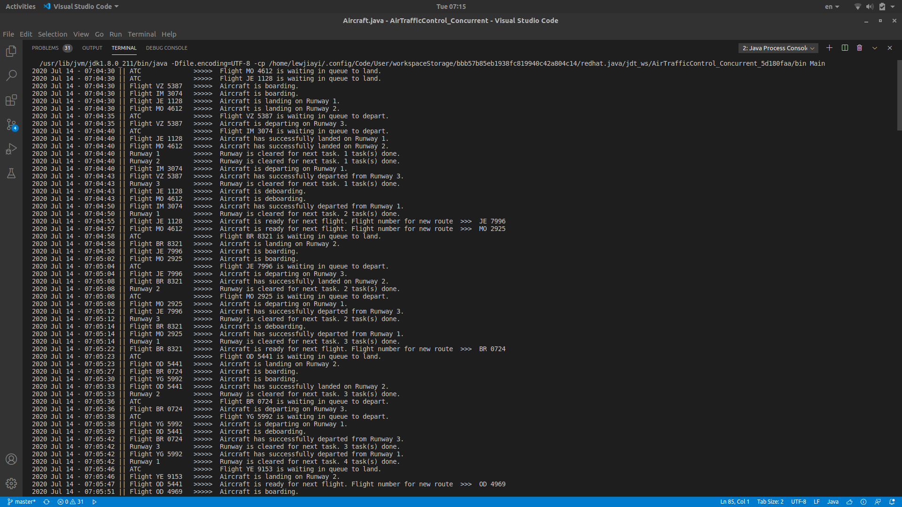
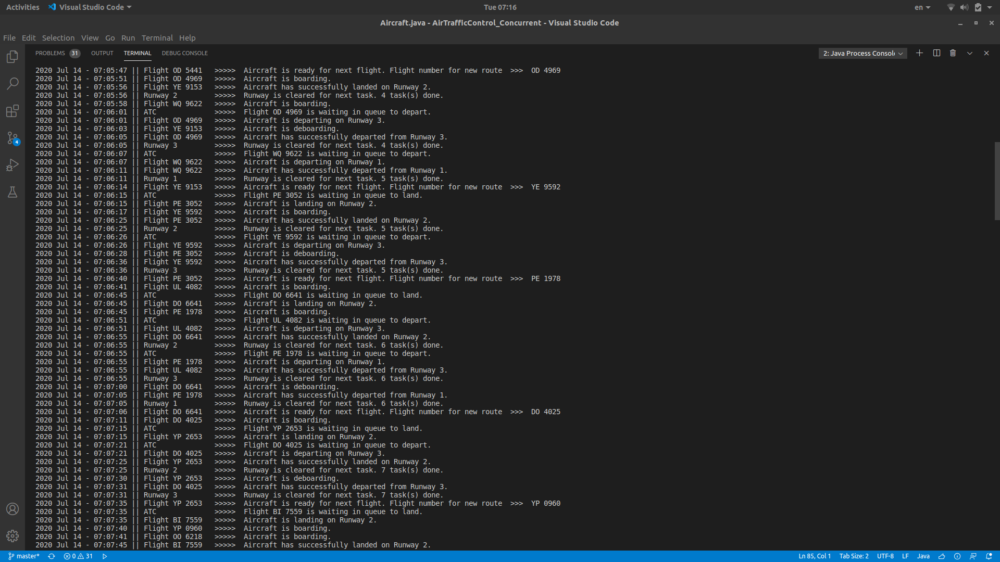
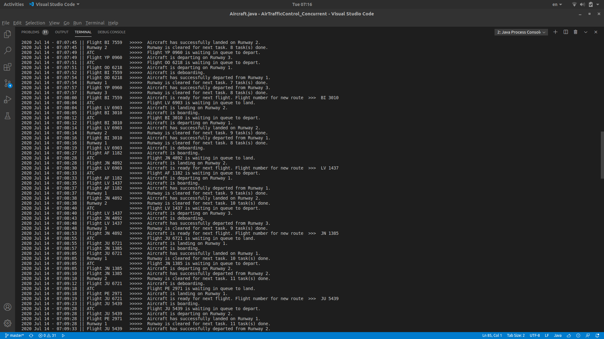
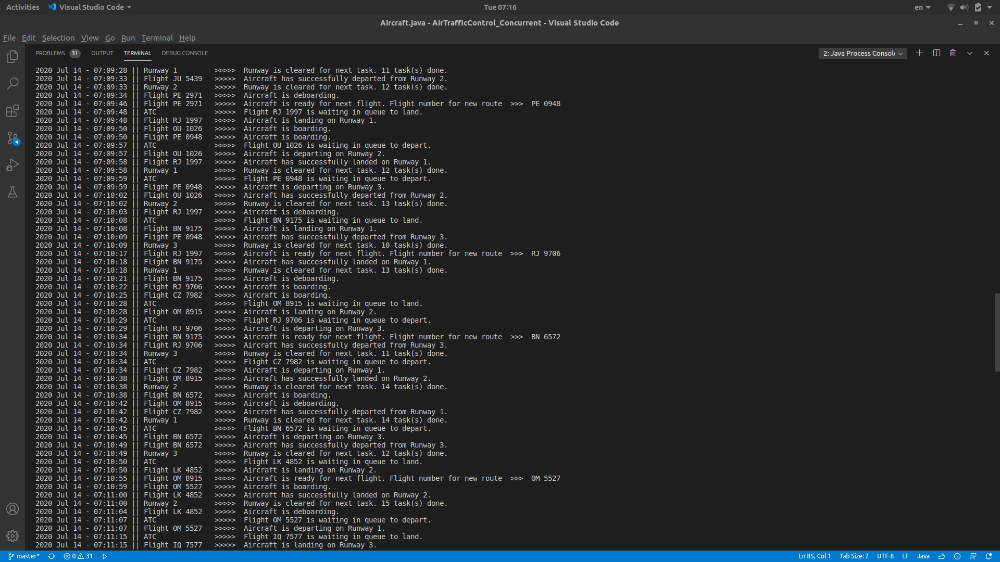
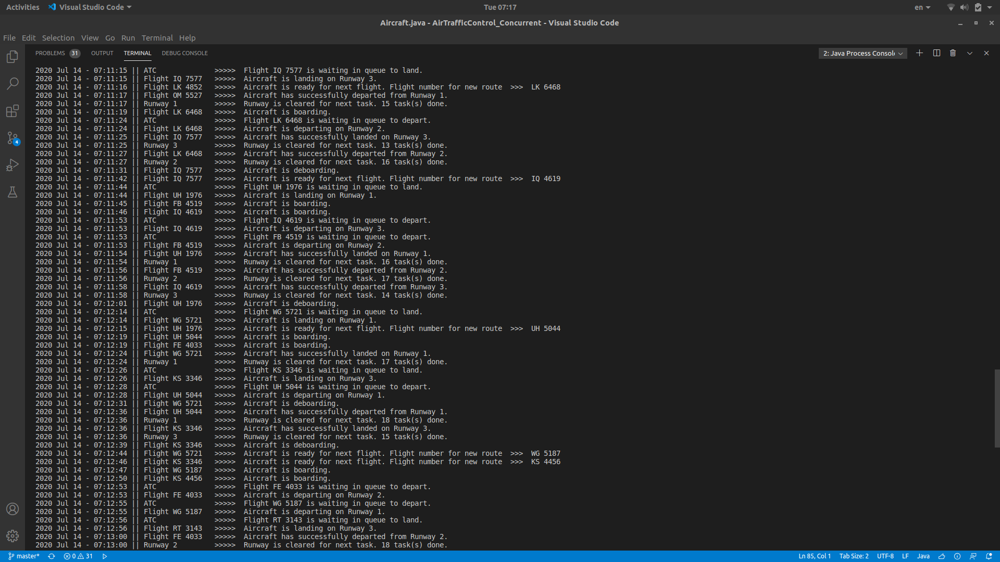
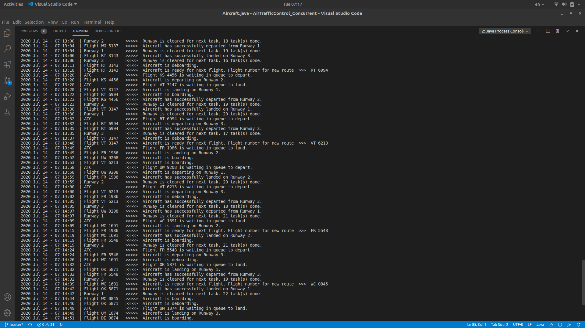

# CSC2044 Concurrent Programming

## Air Traffic Control - Assignment Report

#### by Lew Jiayi

The assignment requires us to create a Air Traffic Control (ATC) concurrent program for an international airport which fullfill a set of given minimun requirement. Based on the requirements, I had added extra features to mimic and simulate a more realistic airport and ATC. Below are the features of this assignment.

1. Prevent deadlock and starvation
2. Landing aircrafts are generated randomly
3. Airport has three runways for aircraft to depart and land
4. Aircraft with high priority are allow to use the runway first
5. Airport has a limited amount of terminal for aircraft board and deboard
6. Each aircraft is represented by a thread and assigned with a different flight number
7. Departing aircrafts are generated based on aircrafts landed on the aiport as well as ramdomly
8. Landing aircraft will take 10 seconds to land, and no aircraft is allowed to take off by using the same runway during this period of time
9. Departing aircraft is not allowed to take off in less than 5 seconds, but it can take longer duration if there is no other aircraft that is going to take off

---

## System design

Since there are 3 runways and countless aircraft running concurrently, they has be run be separate threads. For the aircraft to know if it's their turn to use a runway and which runway to go, we have to create a task for each aircraft that need to use a runway. Each task contains information of the aircraft, type of task (land or depart) and the priority of the task. Since priority is involve, the tasks are to be contained in a priority blocking queue.

> ### **Classes to be created**:
> - **Aircraft (Runnable)**
> - **Runway (Runnable)**
> - **Task**

However, an aircraft should not be able create a task of itself but rather request a unit - ATC. ATC will process the request, create task and put into the queue. When runway are available, it will notify the pull the next task in queue and notify the respective aircraft. The aircraft will then perform their task and notify the runway when they are done. When aircraft is trying to land, they have to get the permission from the airport as the airport might be full at the moment. If so, they will simply requeue and wait for aircraft to depart from the airport

> ### **Classes to be created**:
> - *Aircraft (Runnable)*
> - *Runway (Runnable)*
> - *Task*
> - **ATC (Runnable)**
> - **Airport**

Landing and departing aircraft needs to be generated after a certain timeout. Although the generation can be done within one thread, but having two threads to process request and generate landing and departing aircraft respectively reduce the complexity of the code. Beside, to prevent starvation, the thread has to communicate with runway as well. The complexity of running with one thread will increase exponentially and has high chance of getting into deadlock. Hence, ATC will holds two sub unit threads given ATC Depart and ATC Incoming. Finally, a clock class is used for timestamp and a main class to generate initital objects and start the system.

> ### **Classes to be created**:
> - *Aircraft (Runnable)*
> - *Runway (Runnable)*
> - *Task*
> - *ATC* **~~(Runnable)~~**
> - *Airport*
> - **ATC Depart (Runnable)**
> - **ATC Incoming (Runnable)**
> - **Clock**
> - **Main**

---

## **Classes implementation**

## Aircraft

Aircraft has a flight number, in our case a string consist of 2 upper case alphabets follow by 4 numbers which are generated randomly along with the generation of aircraft. After the aircraft lands, if it is ready to perform next flight, it will be assigned a new flight number. The new flight number will retain the alphabets, changes only the numbers part, similar to real life aircraft. An aircraft can have 9 different status as describe below.

1. **Land Queue**
> The aircraft is waiting in queue for landing. The aircraft will wait for notification from runway to perform its task

2. **Landing**
> The aircraft is landing onto runway

3. **Landed**
> The aircraft succesfully landed on runway and notify runway to perform next task. I did not try to simulate real life situation (chances of failure and accidents), I doesn't like accidents...

4. **Deboarding**
> The aircraft is in terminal and deboarding its passengers. After deboarding, the aircraft has a 1% chance that it will go for maintainance. Else, the aircraft will proceed to getting ready for next flight

5. **Boarding**
> The aircraft is in terminal, passengers are boarding aircraft. After boarding, the aircraft will send a request to ATC Depart to depart from the airport

6. **Depart Queue**
> The aircraft is waiting in queue to depart. The aircraft will wait for notification from runway to perform its task

7. **Deaprting**
> The aircraft is departing from runway

8. **Departed**
> The aircraft succesfully departed on runway. Aircraft will notify runway to perform next task and notify airport aircraft has left airport

9. **Others**
> For miscellaneous reasons, the aircraft will end the thread. In this case, it's used only for maintainance

## Runway

Runways each have a different name and a counter for task done. When the thread starts, it takes the first task from queue and check for it's type. If it's a landing task, the runway will check for the permission from airport for aircraft to land. If permission not granted, the task is requeue. Then runway will notify the aircraft to perform its task while the runway wait for notification from aircraft when task is finishes.

In cases where the queue is empty, the runway will start a 30 seconds timeout waiting. When the thread wakes up, it will check the queue. If the queue is still empty, runway will wake either ATC depart or incoming to force create an new random aircraft. This is to prevent starvation.

## ATC (Main)

The main ATC is not a thread. When construted, ATC will start the sub unit ATC depart and incoming threads. ATC is the main connection with the aircraft and runway, it is used to perform task requeue and checking for departing tasks in queue. As required, the aircraft will have to depart in less than 5 seconds if there are other aircraft waiting to depart.

## ATC Depart

ATC depart (ATCD) has a separate queue used by aircrafts to file request to depart. When run, ATCD check if the queue, for request and process the request if the task queue has less than 5 departing task. If queue is empty, the thread will enter a random 20 - 30 seconds waiting timeout. Aircraft will wake ATCD when sending a request. If the thread wakes up after timeout and there is no request, ATCD will force create a new aircraft to prevent starvation. After adding a task, it will notify runway if the task queue has only one task. If after adding a task and the task queue only has a task, this means the queue was empty. The runway will be waiting for new task in this case.

## ATC Incoming

ATC incoming (ATCI) is much more simple compare to ATCD. ATCI simply wait for a 20 - 30 seconds timeout and generate a random landing task when wake up by any situation. ATCI also notify runway if the task queue has one task after adding a task.

## Airport

Airport has an limited size of 10 aircrafts at all times. It has a synchornized method to grant or deny permission to land an aircraft and a synchornized method to update the list when aircraft left the airport

## Task

Task holds the instance of the aircraft, type of the task, priority and the destination. In this case destination is only used when aircraft landing on airport, since we are not creating other airport for the departed aircraft to go. When a task requeue, it will check its the first requeue. If not, the priority of the task will be set to high to prevent a task waiting for too long in extreme cases.

## Clock

Just a clock. Used to format the timestamp. Nothing much.

---

## **Deadlock and Starvation**

Appropiate actions was taken to prevent the system getting into deadlock and starvation.

## Starvation
To prevent starvation, each generator (ATCD, ATCI) is designed to be extremely simple - wait for timeout, generate task, repeat. Things works well when it is simple, unless you are designing a maze...

However, the waiting time might be too long and any observer might feel the system in entering starvation. Hence, I implemented wait time out instead of sleeping the thread and allow runway to wake the thread is it has no task for 30 seconds.

## Deadlock
To prevent deadlock, again, things are design to be simple and straight forward. Most interaction between threads are one to one and holding only one lock most of the time. ATC is separated into ATCD and ATCI for this reason, the initial design was only having one main ATC thread. However, when there are multiple communications involving ATC, runway and aircraft, while having to generate both departing and incoming aircraft, things quickly get out of hand. ATC could not generate new task as aircraft is trying to request for departure. Runway is then either waiting for aircraft or trying to notify ATC about starvation.

In other cases, when the queue is full, aircrafts could not get their depart request approved. While runway is requeue tasks too much and most landing tasks have high priority, blocking other aircraft to depart. It simply enter a state where no gets to do anything. Despite this is technically not deadlock but the situation is similar. Of cousre this problem can be solved by having two separate queue but separting ATC into two threads just solve almost all problems. In addition, having two queue might also cause fairness problems.

---

## **Sample Output**

The sample output is shown by the 6 pictures below in order. The system run for 10 minutes before I force it to stop. At the latest time, Runway 1 had carried out 22 tasks, Runway 2 done 20 tasks and Runway 3 done 19 tasks.

